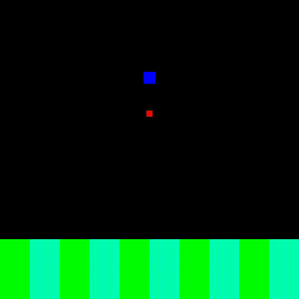

# robot-walking-learning

This project is a test-bed for some of my ideas on how we can train legged robots to walk with minimal supervision.

Three things in this repository that might be of interest to others are:

1. A system by which you can specify the Lagrangian of the robot and the code analytically finds the Netwonian equations and allows timestep-by-timestep integration of the robot configuration. I use sympy as my algebraic equation solver, and the code for it is in `twolink/model.py`.

2. Example code for anyone who wants to try out different Q learning techniques using TensorFlow on a walking legged robot.

3. A writeup on the connection between Q learning and energy-based methods, and how it can practically be implemented on legged robots (taking the Cheetah robot as my robot of interest since it was written during my time in that lab). It can be found [here](res/Evaluating_Optimality_of_Legged_Robot_Controllers.pdf).

## Simulation and Models

I experiment with two different kinds of legged robots with current-controlled motors at their joints. The code for each model is split across two files, `dynamics.py` and `environment.py`, and optionally `model.py`. `dynamics.py` contains the system model that allows for simulation of the robot, provided external and internal forces at each timestep. `environment.py` contains the model that is used for learning, with many state variables abstracted away, mechanical parameters of the robot already provided, and actions to be chosen required as the input at each timestep. For more complicated models, `model.py` contains an analytical equation solver that expresses only the Lagrangian of the system so that the Newtonian equations can be solved for and used for simulation in `dynamics.py`.

### One-Link Legged Robot

One is a simple one-legged robot modeled as a foot with a spring attaching it to the main body. The parameters that can be changed in this model are the mass of the body, the mass of the foot, and the spring constant and equilibrium length of the spring between the body and foot. This is meant to abstract away the "knee" joint as a pre-loaded "spring" controller.

The minimum number of observable state varibles for one-link walking seems to be 3: (1) horizontal velocity of the foot, (2) angle of the foot relative to the body, and (3) angular velocity of the foot relative to the body.

The single action that can be chosen at each timestep is the amount of torque applied at the hip joint.

The code related to this model is in `leg/*.py`.

### Two-Link Legged Robot

In the other model, I don't abstract away the knee joint, producing a true two-link one-legged robot model, with many more parameters that can be modified. These include the masses of the three joints and the lengths of the links between them. The actions that can be chosen for this robot are the torques applied to the knee and foot joint.

The code related to this model is in `twolink/*.py`.

### Environmental Models

In all simulations, I model the ground as a stiff spring that engages upon contact with the ground and gravity as the no-friction constant-acceleration force encountered in the real world.

## Learning Algorithms

I try three different learning algorithms in this project:

1. Table-Based Q Learning: In this approach, the state-space and the action-space of the robot is discretized, and a table records the Q value at each discrete state value. The optimal control action at each point is then the action that leads to the highest Q value. The parameters that can be tweaked here are the learning rate (how quickly the table incorporates updates in the Q value), the exploration rate (with what likelihood that robot should try out actions other than the optimal action during learning), and the number of discrete bins to partition the state and action variables into. The code for this is in `archive/leg_learning.py` (for the old one-link robot) and `reinforce.py` (for the two-link robot).

2. Deep Q Learning: Unlike table-based Q learning, deep Q learning does not discretize the state-space, but it does discretize the action-space. Instead of recording the Q values of each state in the table, it uses a neural network to learn the mapping of current state to the optimal control action. The paramters that can be adjusted here are all of the typical parameters governing neural networks in addition to the exploration rate, the learning rate, an dthe gamma constant of the value function. The code for this is in `archive/leg_dqn.py`.

3. Particle Swarm Optimization: Here, the optimal control law is not learned as a function mapping current state to optimal action. Instead, it is assumed that it has a general form (such as that the optimal torque to exert at a joint is proportional to the square of the angle of the joint) and the parameters for the specific form have to be determined. For robot walking, the function to be optimized over is the total sum of rewards over the period the robot walks without falling. The parameters to be optimized are the parameters of the general control law we've conceived. Normally, gradient descent would be a useful strategy for such an optimization problem, but for functions that don't have an easily computable gradient and could possibly have multiple minima, particle swarm optimization is a good approach since it simulates multiple agents searching for a minimum simultaneously. The advantage is that we have a lot fewer parameters to learn for our Q function, but the disadvantage, of course, is that we're constrained to searching among only a small subset of possible control laws. The code for this is in `learn.py`.

## Implementation

(Documentation is still in progress)

## Results

Above is a one-link robot that was trained to walk 85 meters without falling using particle swarm optimization. Similar results were obtained using both deep Q learning and table-based Q learning.

I tried a number of different ideas:

1. Modifying the learning and exploration rate over time so they start off large and fall to zero

2. Reducing the dimensionality of the observable state-space and action-space

3. For discretized approaches, reducing the number of bins of the observable state-space and action-space

4. Modifying the reward function

I found that the last three modifications had the greatest effect on performance, in that order. The reward function I ended up choosing is the amount of distance traversed in each timestep, and the discretization of the action- and state-space I did by powers of ten. This allowed me to get the 85 meters result that I did.
